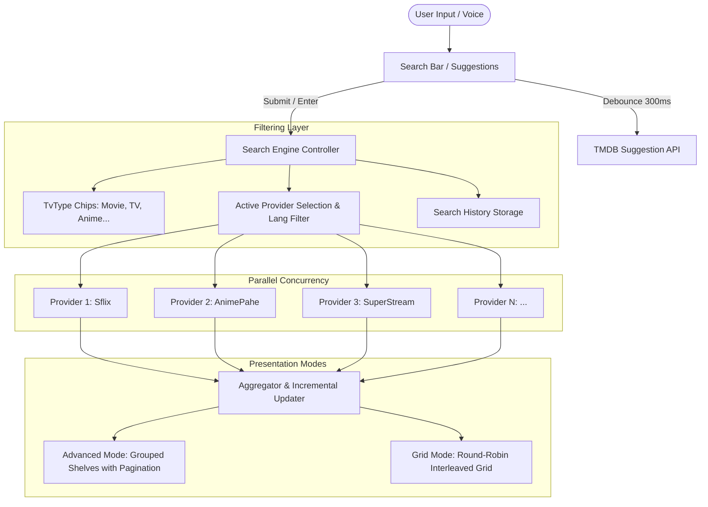

# CloudStream Search Architecture & Desktop Implementation Specification

> **Source Analysis:** CloudStream 3 Android App (`com.lagradost.cloudstream3.ui.search`, `quicksearch`, `APIRepository`, `MainAPI`)  
> **Target Platform:** CloudStream Desktop (Tauri + Rust + React + TypeScript + Vanilla CSS)  
> **Document Status:** Comprehensive Analysis & Implementation Guide (Ready for Review)

---

## Table of Contents
1. [Executive Summary](#1-executive-summary)
2. [CloudStream Android Search Architecture Deep-Dive](#2-cloudstream-android-search-architecture-deep-dive)
   - 2.1. ViewModels & Concurrency Management (`SearchViewModel`)
   - 2.2. Multi-Provider Parallel Query Engine (`amap` & `APIRepository`)
   - 2.3. The Round-Robin Interleaving Algorithm (`bundleSearch`)
   - 2.4. Infinite Pagination & Expansion per Provider (`expandAndReturn`)
   - 2.5. Search Suggestions API & Debouncing (`SearchSuggestionApi`)
   - 2.6. Search History System (`SearchHistoryItem`)
   - 2.7. Quick Search vs Full Search (`QuickSearchFragment`)
3. [Search UI/UX & Interaction Workflows](#3-search-uiux--interaction-workflows)
   - 3.1. Dual-Display Modes (Advanced Grouped Shelves vs Unified Grid)
   - 3.2. Filtering Matrix (TvTypes Chips & Active Provider Selection)
   - 3.3. Card Metadata Rendering (`SearchResultBuilder`)
   - 3.4. Voice Search Integration
4. [Extension / Plugin Search Contract](#4-extension--plugin-search-contract)
   - 4.1. `MainAPI` Methods (`search`, `quickSearch`, `getMainPage`)
   - 4.2. Response Models & Polymorphism (`SearchResponse`, `AnimeSearchResponse`, etc.)
   - 4.3. Timeout Handling & Error Isolation
5. [Desktop Implementation Blueprint](#5-desktop-implementation-blueprint)
   - 5.1. Rust Backend IPC Commands & Architecture
   - 5.2. Frontend State Architecture & React Hooks
   - 5.3. Frontend Component Breakdown
   - 5.4. Keyboard Shortcuts & TV/Desktop Navigation
   - 5.5. CSS Design System & Visual Polish
6. [Step-by-Step Implementation Roadmap](#6-step-by-step-implementation-roadmap)

---

## 1. Executive Summary

In CloudStream, search is not a simple monolithic API query; it is a **distributed, multi-provider aggregator** capable of concurrently querying dozens of independent scraping extensions (.cs3 plugins) in real-time, resiliently handling slow/failed providers, aggregating and interleaving multi-type media results, providing live TMDB suggestions, and offering both grouped-by-provider shelf views and unified round-robin grid views.

This document breaks down every component, algorithm, data structure, and UI mechanic from the Android application, and translates them into a desktop implementation plan for **CloudStream Desktop**.



---

## 2. CloudStream Android Search Architecture Deep-Dive

### 2.1. ViewModels & Concurrency Management (`SearchViewModel`)

The Android search engine is managed by `SearchViewModel.kt`. Key architectural features:

1. **Race Condition Prevention (`currentSearchIndex`)**:
   - Each search increments `currentSearchIndex`.
   - Before emitting results or updating state from an asynchronous coroutine, the index is verified:
     ```kotlin
     if (currentSearchIndex != currentIndex) return@amap
     ```
   - This ensures fast typers do not receive stale responses out of order.

2. **Active Job Cancellation (`onGoingSearch?.cancel()`)**:
   - When a new search is initiated, `searchAndCancel(query, ...)` terminates any in-flight coroutine job immediately.

3. **Incremental Live UI Updates**:
   - Results are emitted incrementally as each provider finishes querying via `_currentSearch.postValue(expandableSearches)`.
   - The user sees fast providers (e.g. 150ms) populate instantly while slower providers (e.g. 1.5s) stream in subsequently without blocking the UI.

4. **State Observables**:
   - `searchResponse`: Emits `Resource<ExpandableSearchList>` for the bundled flat grid.
   - `currentSearch`: Emits `Map<String, ExpandableSearchList>` for provider-grouped shelves.
   - `currentHistory`: Emits `List<SearchHistoryItem>` when the query is empty.
   - `searchSuggestions`: Emits `List<String>` live TMDB query suggestions.

---

### 2.2. Multi-Provider Parallel Query Engine (`amap` & `APIRepository`)

CloudStream runs provider requests concurrently using asynchronous parallel mapping:

```kotlin
withContext(Dispatchers.IO) {
    repos.filter { a ->
        (ignoreSettings || (providersActive.isEmpty() || providersActive.contains(a.name))) &&
        (!isQuickSearch || a.hasQuickSearch)
    }.amap { a ->
        val search = if (isQuickSearch) a.quickSearch(query) else a.search(query, 1)
        if (currentSearchIndex != currentIndex) return@amap
        if (search is Resource.Success) {
            val searchValue = search.value
            expandableSearches[a.name] = ExpandableSearchList(searchValue.items, 1, searchValue.hasNext)
        }
        _currentSearch.postValue(expandableSearches)
    }
}
```

#### Key Elements:
- **Provider Filtering**: Only queries providers enabled in settings, selected in filter dialog, matching active media types (`supportedTypes`), and supporting `quickSearch` if in quick-search mode.
- **Error Isolation**: Each provider execution is wrapped in `safeApiCall` with strict timeouts (`withTimeout(api.searchTimeoutMs)`). A crashed or timed-out extension does not affect other providers.

---

### 2.3. The Round-Robin Interleaving Algorithm (`bundleSearch`)

When displaying search results in a unified grid, simple concatenation would cause the first provider to dominate the top results. CloudStream uses a **round-robin interleaving algorithm** to fairly prioritize the best match from *every* active provider at the top:

```kotlin
private fun bundleSearch(lists: MutableMap<String, ExpandableSearchList>): ExpandableSearchList {
    if (lists.size == 1) {
        return lists.values.first()
    }

    val list = ArrayList<SearchResponse>()
    val nestedList = lists.map { it.value.list }

    var index = 0
    while (true) {
        var added = 0
        for (sublist in nestedList) {
            if (sublist.size > index) {
                list.add(sublist[index])
                added++
            }
        }
        if (added == 0) break
        index++
    }

    return ExpandableSearchList(list, 1, false)
}
```

#### How it Works:
- **Round 0**: Take 1st result from Provider A, 1st from Provider B, 1st from Provider C...
- **Round 1**: Take 2nd result from Provider A, 2nd from Provider B, 2nd from Provider C...
- Guarantees diversity on the top rows regardless of how many results individual providers returned.

---

### 2.4. Infinite Pagination & Expansion per Provider (`expandAndReturn`)

When a user scrolls to the end of a provider shelf or clicks "See More / Expand":
1. `expandAndReturn(providerName)` locks the provider name in a mutex set.
2. Calls `repo.search(query, currentPage + 1)`.
3. Appends new results, deduplicating by URL:
   ```kotlin
   this.list = (this.list + nextValue.items).distinctBy { it.url }
   ```
4. Updates both `_currentSearch` (shelf view) and `_searchResponse` (bundled grid view).

---

### 2.5. Search Suggestions API & Debouncing (`SearchSuggestionApi`)

Live query suggestions are fetched using TheMovieDB Multi-Search API:

- **Endpoint**: `https://api.themoviedb.org/3/search/multi`
- **Debounce**: 300ms delay to prevent API spam while typing.
- **Minimum Length**: 2 characters.
- **Cache**: 24 hours (`cacheTime = 60 * 24`).
- **Filtering**:
  - Filter by `media_type == "movie" || media_type == "tv"`.
  - Extract `title` or `name`.
  - Return top 10 unique strings.
- **User Actions**:
  - **Click Item**: Directly sets search query and executes search.
  - **Click Arrow (Fill)**: Fills search bar without auto-executing, allowing further typing.
  - **Clear Suggestions**: Dismisses overlay.

---

### 2.6. Search History System (`SearchHistoryItem`)

- **Data Model**:
  ```kotlin
  @Serializable
  data class SearchHistoryItem(
      val searchedAt: Long,
      val searchText: String,
      val type: List<TvType>,
      val key: String // Hash code of query
  )
  ```
- **Storage**: Key-value store under `$currentAccount/search_history/$key`.
- **Display Trigger**: Shown automatically when the search input is blank or focused.
- **Operations**:
  - **Open**: Re-populates search input & active `TvType` chips and executes search.
  - **Delete Single**: Deletes key from storage and updates LiveData.
  - **Clear All**: Prompts with confirmation dialog and deletes all entries.

---

### 2.7. Quick Search vs Full Search (`QuickSearchFragment`)

CloudStream provides a lightweight Quick Search mode:
- **Instant Search on Keystroke**: For providers implementing `hasQuickSearch = true` and `quickSearch(query)`.
- **Targeted Provider Routing**: Allows passing specific providers (e.g. searching only within an anime provider when selecting anime).
- **Auto-Search parameter**: Support for deep-linking (`autosearch` parameter) which automatically strips tags like `(DUB)`, `(SUB)` before searching.

---

## 3. Search UI/UX & Interaction Workflows

### 3.1. Dual-Display Modes

CloudStream supports two distinct search display modes:

| Mode | Layout Component | User Experience |
|---|---|---|
| **Advanced Mode** (Default) | `search_master_recycler` | Grouped shelves per provider. Pinned providers appear at top. Each shelf can be horizontally scrolled or expanded into full view. |
| **Grid Mode** | `search_autofit_results` | Unified autofit grid combining all providers using the Round-Robin algorithm. |

Users can switch between these modes in settings (`advanced_search` boolean).

---

### 3.2. Filtering Matrix

#### A. Media Type Chips Bar (`tvtypes_chips_scroll`)
- Quick filter chips: `All`, `Movies`, `TV Shows`, `Anime`, `Asian Drama`, `Cartoons`, `Documentaries`, `Live Streams`, `Torrents`.
- Toggling chips dynamically filters available providers by comparing `api.supportedTypes` with active chips.

#### B. Provider Selection Dialog (`HomeSelectMainpageBinding`)
- Triggered by filter button (`ic_baseline_tune_24`).
- Bottom sheet / Modal containing:
  - Language flags (`SubtitleHelper.getFlagFromIso(lang)`) for each provider.
  - Checkboxes for active/inactive search providers.
  - Multi-select media type chips inside the modal.
  - "Apply" and "Clear / Select All" buttons.

---

### 3.3. Card Metadata Rendering (`SearchResultBuilder`)

Each search result card displays rich contextual badges based on polymorphic response types:

1. **Poster Image**: Loaded with custom headers (User-Agent, Referer) when required.
2. **Title**: Configurable overlay with gradient shadow.
3. **Dub/Sub Badges (Anime)**:
   - "DUB" / "DUB 12 eps"
   - "SUB" / "SUB 24 eps"
4. **Quality Badges**: BluRay, 4K, UHD, 1080p, HD, HQ, WebRip, CAM, etc.
5. **Rating Score**: TMDB rating or sync provider score (e.g. `⭐ 8.4`).
6. **Watch Progress Bar**: If previously watched, shows duration/position bar and last played episode indicator (e.g. `S1:E4`).
7. **Flag Badges**: Country flag for Live Streams.

---

## 4. Extension / Plugin Search Contract

### 4.1. `MainAPI` Methods

In CloudStream provider plugins (`MainAPI`):

```kotlin
// Paginated full search
open suspend fun search(query: String, page: Int): SearchResponseList?

// Simple full search (default page 1)
open suspend fun search(query: String): List<SearchResponse>?

// Quick lightweight search (optional for live search typing)
open suspend fun quickSearch(query: String): List<SearchResponse>?
```

### 4.2. Response Models

- `MovieSearchResponse`: `name`, `url`, `posterUrl`, `year`, `quality`
- `TvSeriesSearchResponse`: `name`, `url`, `posterUrl`, `episodes`, `season`
- `AnimeSearchResponse`: `name`, `url`, `posterUrl`, `dubStatus`, `episodes` (Map of DubStatus to count)
- `LiveSearchResponse`: `name`, `url`, `posterUrl`, `lang`
- `TorrentSearchResponse`: `name`, `url`, `posterUrl`, `seeders`, `leechers`, `size`

---

## 5. Desktop Implementation Blueprint

To deliver the full CloudStream Search experience on Desktop (Tauri + React + Rust), we structure the implementation into clear layers:

### 5.1. Rust Backend IPC Commands

Add the following Tauri commands in `src-tauri`:

```rust
// 1. Multi-provider parallel search with optional active provider list
#[tauri::command]
async fn search_media_multi(
    query: String,
    providers: Option<Vec<String>>,
    types: Option<Vec<String>>,
    page: Option<u32>,
    state: State<'_, AppState>,
) -> Result<SearchMultiResult, String>;

// 2. Fetch live search suggestions from TMDB
#[tauri::command]
async fn get_search_suggestions(query: String) -> Result<Vec<String>, String>;

// 3. Search history management (SQLite / local JSON store)
#[tauri::command]
async fn get_search_history(state: State<'_, AppState>) -> Result<Vec<SearchHistoryItem>, String>;

#[tauri::command]
async fn add_search_history(item: SearchHistoryItem, state: State<'_, AppState>) -> Result<(), String>;

#[tauri::command]
async fn remove_search_history(key: String, state: State<'_, AppState>) -> Result<(), String>;

#[tauri::command]
async fn clear_search_history(state: State<'_, AppState>) -> Result<(), String>;
```

#### Search Response Types in Rust:
```rust
#[derive(Serialize, Deserialize, Clone, Debug)]
pub struct ProviderSearchResult {
    pub provider: String,
    pub items: Vec<SearchResponse>,
    pub current_page: u32,
    pub has_next: bool,
}

#[derive(Serialize, Deserialize, Clone, Debug)]
pub struct SearchMultiResult {
    pub grouped: Vec<ProviderSearchResult>,
    pub bundled: Vec<SearchResponse>, // Round-robin interleaved
}
```

---

### 5.2. Frontend State Architecture (Search Hook / Zustand Store)

Create a dedicated search store `useSearchStore`:

```typescript
interface SearchState {
  query: string;
  isSearching: boolean;
  selectedTypes: TvType[];
  selectedProviders: string[];
  viewMode: 'grouped' | 'grid'; // Advanced shelves vs Unified grid
  
  // Results
  groupedResults: Record<string, { items: SearchResponse[]; page: number; hasNext: boolean }>;
  bundledResults: SearchResponse[];
  
  // Suggestions & History
  suggestions: string[];
  history: SearchHistoryItem[];
  isSuggestionsOpen: boolean;
  
  // Actions
  setQuery: (q: string) => void;
  toggleType: (type: TvType) => void;
  setProviders: (providers: string[]) => void;
  executeSearch: (query: string) => Promise<void>;
  expandProvider: (providerName: string) => Promise<void>;
  clearHistory: () => Promise<void>;
  deleteHistoryItem: (key: string) => Promise<void>;
}
```

---

### 5.3. Frontend Component Breakdown

Create the following modular components in `src/screens/search/` or `src/components/search/`:

```
src/
├── components/
│   └── search/
│       ├── SearchBar.tsx              # Input, clear button, loader, filter trigger
│       ├── SearchSuggestions.tsx      # TMDB suggestion dropdown overlay with Fill/Search actions
│       ├── SearchHistoryView.tsx      # Recents list with single delete & clear all confirmation
│       ├── SearchFilterModal.tsx      # Multi-select provider modal with flags & select-all
│       ├── SearchTypeChips.tsx        # Horizontal scrolling TvType chips
│       ├── SearchGroupedShelves.tsx   # Advanced mode: Provider horizontal shelves with "Expand"
│       ├── SearchUnifiedGrid.tsx      # Grid mode: Round-robin interleaved media cards
│       └── SearchCardBadges.tsx       # Sub/Dub, Quality, Rating, Progress badges
└── screens/
    └── SearchScreen.tsx               # Main Search View assembling all sub-components
```

---

### 5.4. Keyboard Shortcuts & TV/Desktop Navigation

Desktop apps require first-class keyboard navigation:
- `/` or `Ctrl + F`: Focus search bar instantly.
- `Escape`: Clear search query or dismiss suggestions / filter modal.
- `ArrowDown / ArrowUp`: Navigate suggestions dropdown or grid items.
- `Enter`: Execute search or select focused suggestion/media card.
- `Tab / Shift+Tab`: Cycle between search input, media type chips, and results.

---

### 5.5. Visual Design Tokens & Aesthetic Principles

Follow the established dark glassmorphic design system:
- **Search Header**: Floating dark glass card (`backdrop-filter: blur(16px); background: rgba(22, 21, 34, 0.85);`).
- **Active Type Chips**: Glowing purple/crimson accent badges (`background: linear-gradient(135deg, #7c3aed, #db2777);`).
- **Provider Filter Modal**: Polished modal with language flags (`🇺🇸`, `🇯🇵`, `🇪🇸`), badge counters, and smooth toggle switches.
- **Card Badges**: Sleek corner chips with semi-transparent tinted backgrounds for Dub/Sub, 4K/HD quality, and score badges.

---

## 6. Step-by-Step Implementation Roadmap

When approved by the user, the implementation should proceed in these structured phases:

1. **Phase 1: Rust Backend Query Aggregator**
   - Add parallel search execution in Tauri backend with round-robin interleaving logic.
   - Implement TMDB suggestions endpoint with server-side/client caching.
   - Add SQLite / local storage for search history.

2. **Phase 2: Types & State Store**
   - Define all search contracts, history models, and filter configurations in `src/types.ts`.
   - Implement `useSearchStore` with debouncing, race condition guards, and provider expansion.

3. **Phase 3: Search UI Components**
   - Build `SearchBar`, `SearchTypeChips`, `SearchSuggestions`, and `SearchHistoryView`.
   - Build `SearchFilterModal` for provider and language selection.

4. **Phase 4: Dual Display Modes**
   - Implement `SearchGroupedShelves` (Advanced Mode) with lazy-loading and per-shelf pagination.
   - Implement `SearchUnifiedGrid` (Grid Mode) with responsive auto-fit columns.
   - Enhance `MediaCard` with `SearchCardBadges` (Dub/Sub, Quality, Rating, Progress).

5. **Phase 5: Keyboard Navigation & Polish**
   - Implement hotkeys (`/`, `Ctrl+F`, `Esc`, arrow keys).
   - Test multi-provider search with active `.cs3` plugins.

---

*This specification is stored as a persistent technical blueprint for CloudStream Desktop.*
